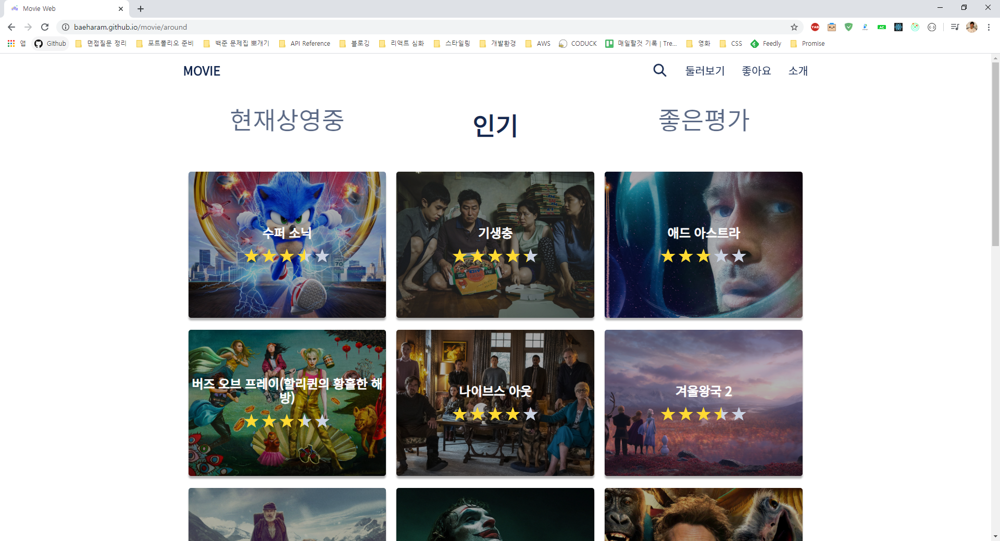
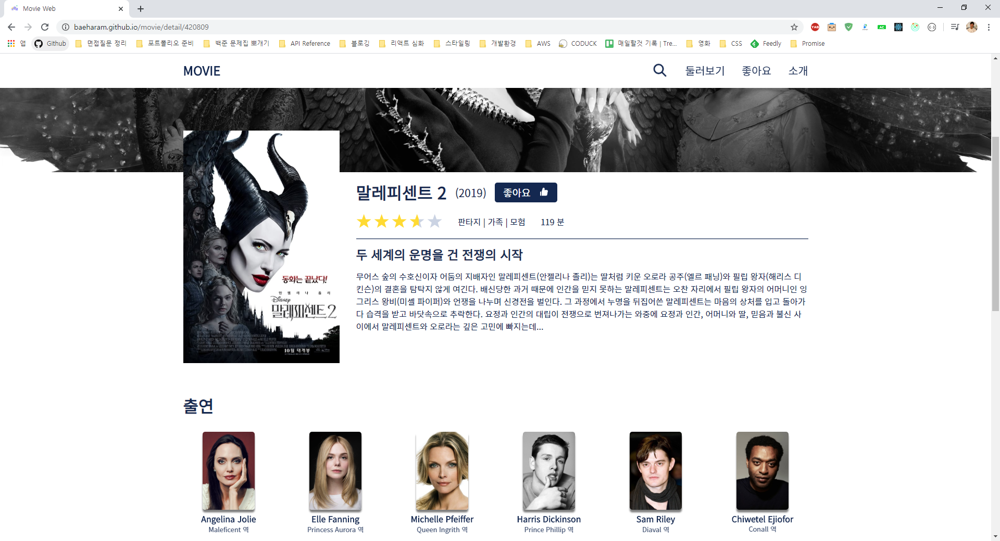
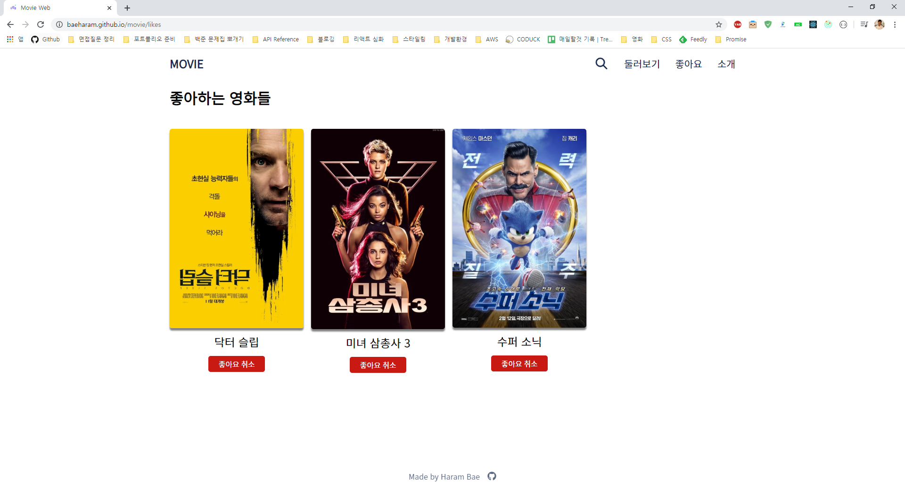
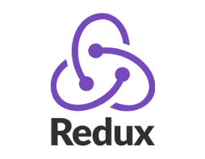
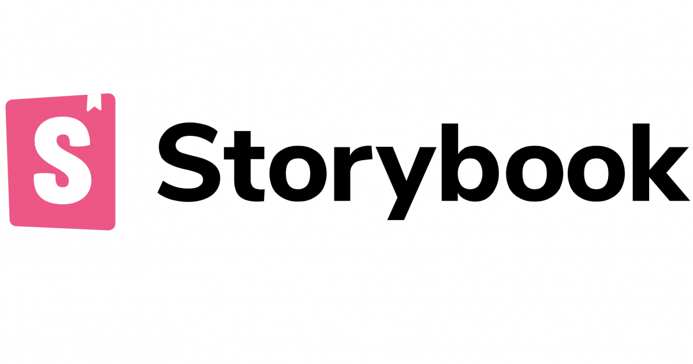
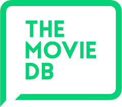
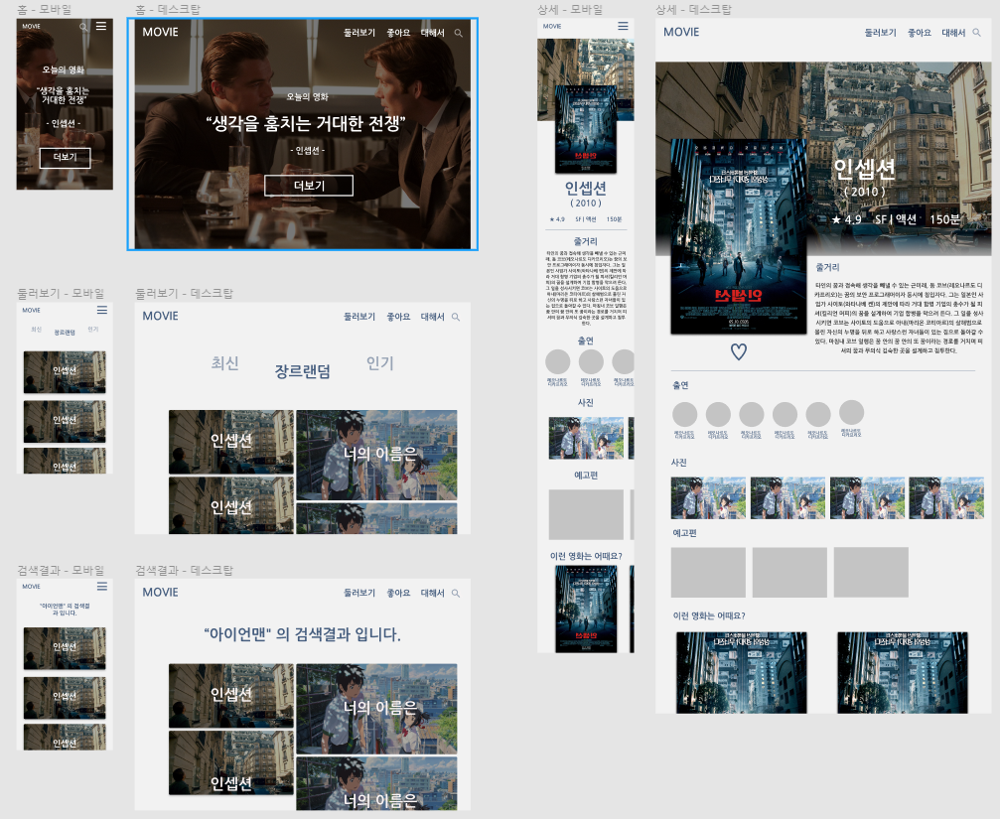
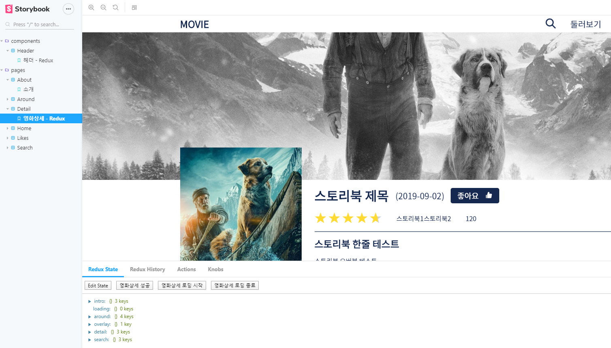

# Movie

  

#### [웹사이트](https://baeharam.github.io/Movie/)

## 프로젝트 소개

TMDB(The Movie DataBase) API를 활용해서 만든 리액트 프로젝트로 API를 활용하여 영화를 검색하고 찾아보며, 영화의 상세 정보를 확인할 수 있는 기능을 제공합니다.

 

## 웹사이트 화면

|             홈              |           둘러보기            |
| :-------------------------: | :---------------------------: |
|  |  |

|           영화상세            |            좋아요            |
| :---------------------------: | :--------------------------: |
|  |  |

|             검색              |             소개             |
| :---------------------------: | :--------------------------: |
|  |  |

 

## 기술 스택

|               UI 라이브러리                |                      라우팅                       |                  상태관리                  |                비동기 상태 관리                 |
| :----------------------------------------: | :-----------------------------------------------: | :----------------------------------------: | :---------------------------------------------: |
|  |  |  |  |

|                        스타일링                        |             테스팅 프레임워크             |                         DOM 테스팅                          |                   UI 테스팅                    |
| :----------------------------------------------------: | :---------------------------------------: | :---------------------------------------------------------: | :--------------------------------------------: |
|  |  |  |  |

|                프로토타이핑                 |                 오픈 API                  |
| :-----------------------------------------: | :---------------------------------------: |
|  |  |

 

## 프로토타이핑

프로젝트를 시작하기전, 제일 먼저 **Figma** 를 사용하여 전체적인 프로토타이핑을 하였습니다. Mobile-first로 진행할 것이었기 때문에 모바일 화면에서 데스크탑 화면 순으로 만들어나갔습니다. 실제로 만들어진 결과물과 완전히 똑같지는 않지만 그래도 화면이 있는 상태에서 코드를 짜는 것은 훨씬 편했습니다.

[Figma 프로토타입](https://www.figma.com/file/qe5sMsXBkH4gWhxuxNCQ2t/Movie-Web?node-id=0%3A1) 에서 확인할 수 있습니다.

 

## 테스팅

프로젝트를 진행해나감에 있어서, 처음으로 테스팅을 적용해보았습니다. 다른 프로젝트들을 통해서 테스트 코드가 없는 코드들은 굉장히 불안정하다는 것을 느꼈기 때문에 새로운 페이지 컴포넌트를 만들 때마다 그에 해당하는 테스트 코드를 작성하였습니다. TDD(Test-Driven Development)를 수행하지 못한점이 아쉽지만 테스트 코드를 작성하는 것으로 프로젝트가 테스트를 하지 않았을 때보다 견고해진다는 것을 느꼈습니다. 테스트 프레임워크로 Jest를 사용하였고 화면에 잘 렌더링되었는가를 테스트하기 위해 react testing library를 사용하였습니다. 제가 테스트를 적용한 경우는 아래와 같습니다.

* 특정 기능을 실행시켰을 때 해당 컴포넌트가 알맞게 렌더링되는가?
* 라우팅이 제대로 동작하는가?
* 리듀서가 디스패치되는 액션에 따라서 알맞은 상태를 업데이트하는가?
* 리듀서가 업데이트 한 상태에 따라 화면을 잘 렌더링하는가?

DOM 테스팅 말고도 UI 검증을 위한 테스트 도구로 Storybook을 사용하였습니다. 이를 통해서 Redux의 상태 및 props에 따라 다르게 렌더링되는 화면을 편하게 테스트할 수 있었습니다. (아래 사진)

 

## 프로젝트를 통해 배운 것들

* Redux를 사용해서 상태관리를 하는 방법
* Redux-Saga를 사용해서 비동기로 변하는 상태관리를 하는 방법
* Styeld components를 사용해서 각 컴포넌트를 CSS-in-JS 방식으로 스타일링 하는 방법
* React testing library를 사용해서 DOM을 테스트하는 방법
* 오픈 API와 axios를 사용해서 데이터를 가져오는 방법
* LocalStorage를 사용하는 방법
